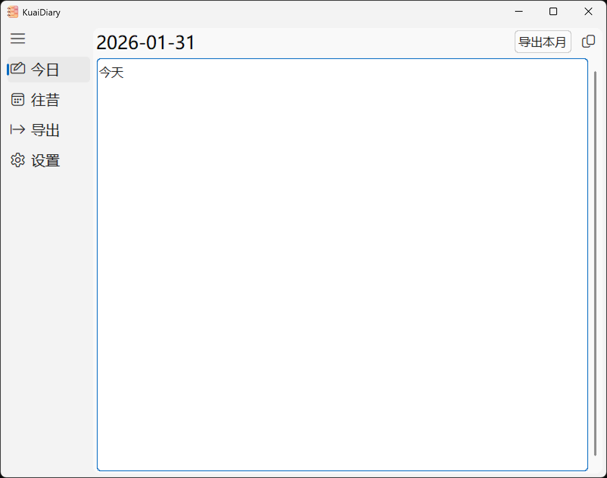
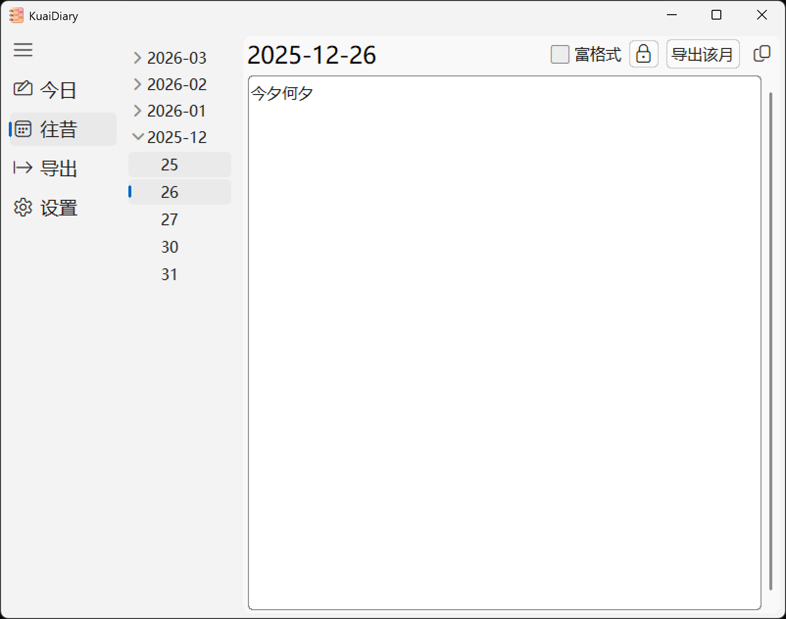
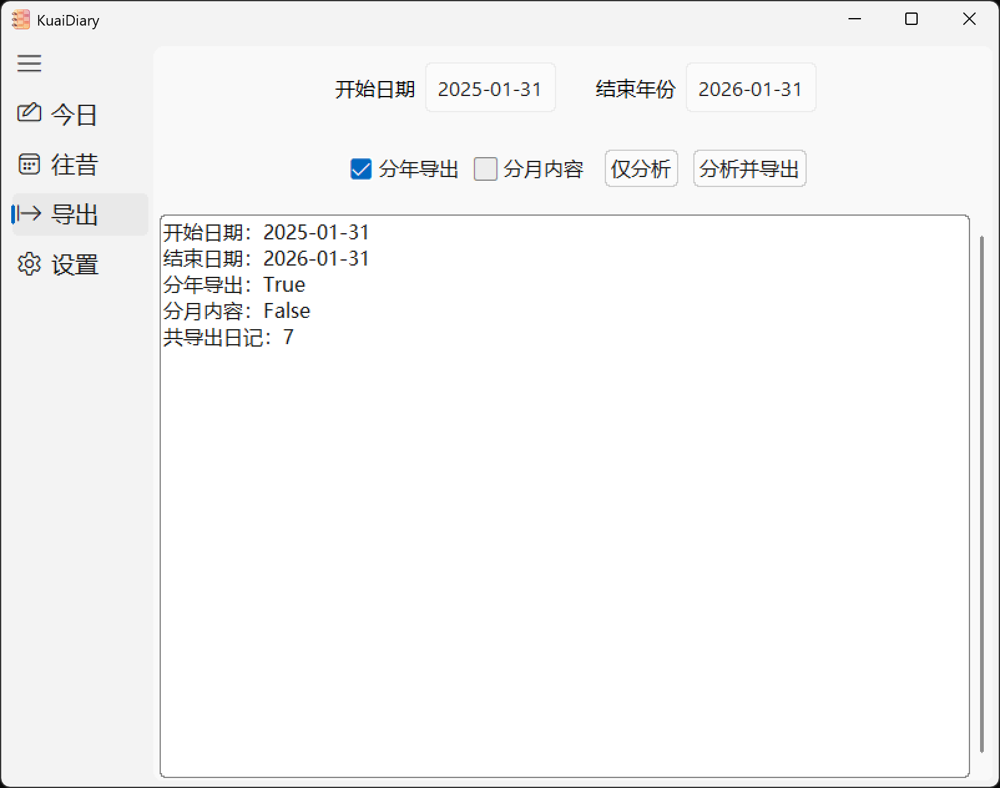
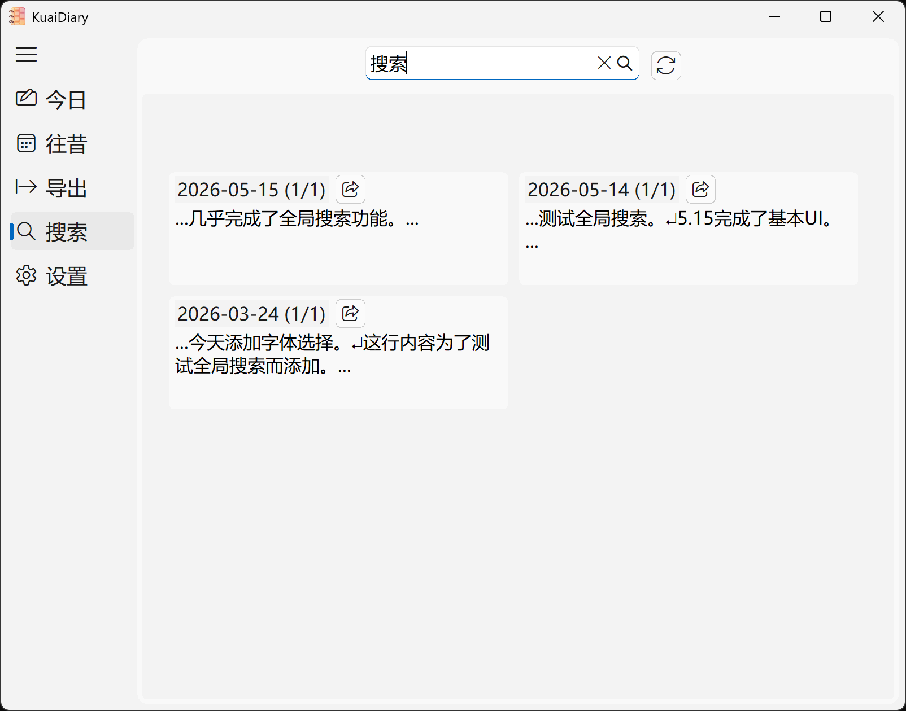
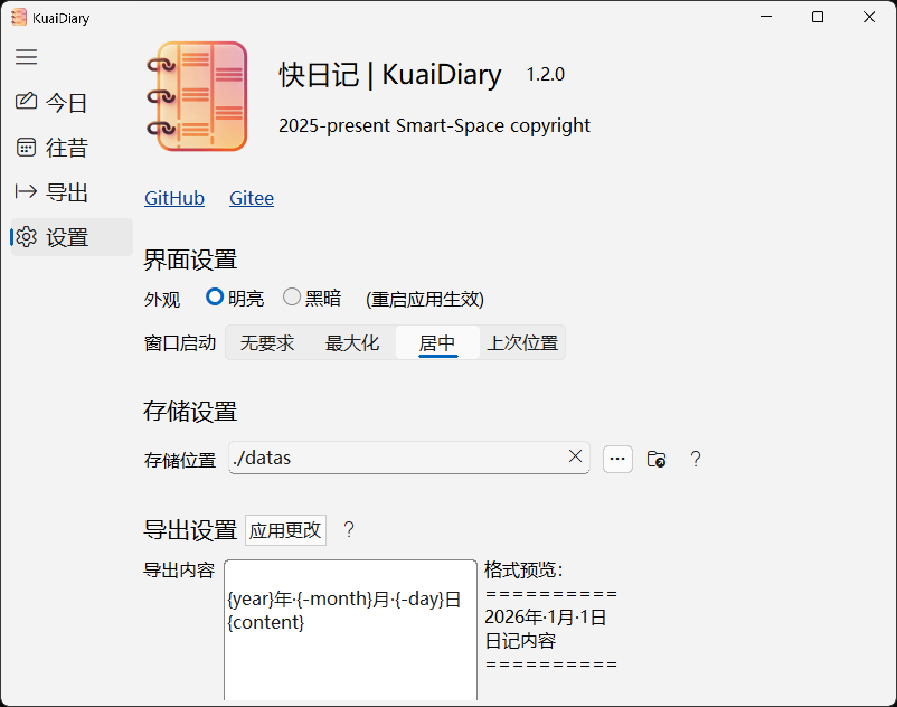

<div align="center">
    
	<h1>KuaiDiary</h1>
</div>

**快日记**，开包即用的纯文本日记软件。

## 特性

- 小、轻、快

- 日记默认存储在`./datas`下，方便自行管理

- 批量、自定义导出

- 无感编辑，无需在意日记的新建与修改后的保存操作

- 基础富文本格式支持

- 全局搜索

  > 超链接需要通过`Control`和鼠标左键单击打开。

## 使用说明

### 当天日记

应用首页为当天日记空白页，如果当天日记已经存在，则会显示已有内容。

当天日记会在关闭时自动保存。如果保存时内容为空，则会删除当天已有日记文件，如果此时当月没有其他日记，也会删除当月文件夹。

右上角可以导出当月所有日记到指定文本文件里，点击按钮右侧的复制图标，可以将本月日记文本加载到剪切板中。

### 过往日记

除了当天日记，可以查看并更改以往任何一天的日记，变更的内容会在日期选择切换或应用关闭时自动保存。

但是，如果想通过清空内容来删除某一天的日记嘛，对不起啦，**快日记**仍然会保留这一天的日记文件，只不过里面空空如也，真想删除的话，请在日记文件夹里手动删除。

过往日记满载着繁多回忆，不应随意更改，如果确实需要修改，请点击🔒图标解锁修改功能，可随时关闭修改功能。

右上角可以导出所选日记所在月份所有日记到指定文本文件里，点击按钮右侧的复制图标，可以将该月日记文本加载到剪切板中。

### 批量导出

选择合适的起止日期，进行批量导出。

### 全局搜索

输入关键字并在所有日记中进行搜索。

### 快捷键

富文本编辑时：

- `Ctrl+B`粗体
- `Ctrl+I`斜体
- `Ctrl+U`下划线

## 安装

### 发行版

在Release界面下载安装包或免安装压缩包。

> 仅在Windows11 64位上进行过测试和编译。

### 源码构建

1. 克隆或下载本项目源码

2. 将`simple`（用于sqlite）发行版放置在根目录下，目录名为`libsimple-windows-x64`（`/control/search.py`硬编码，其他平台自行更改）。

3. 安装tinui

   ```cmd
   pip install tinui
   ```
4. 运行`main.py`即可

## 截图










